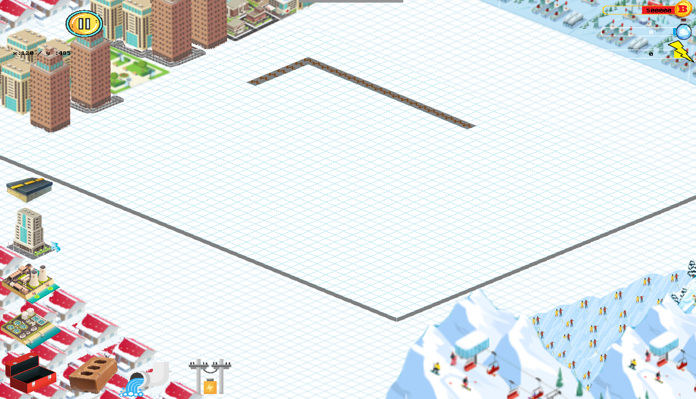
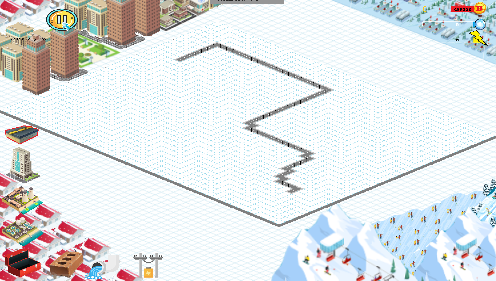
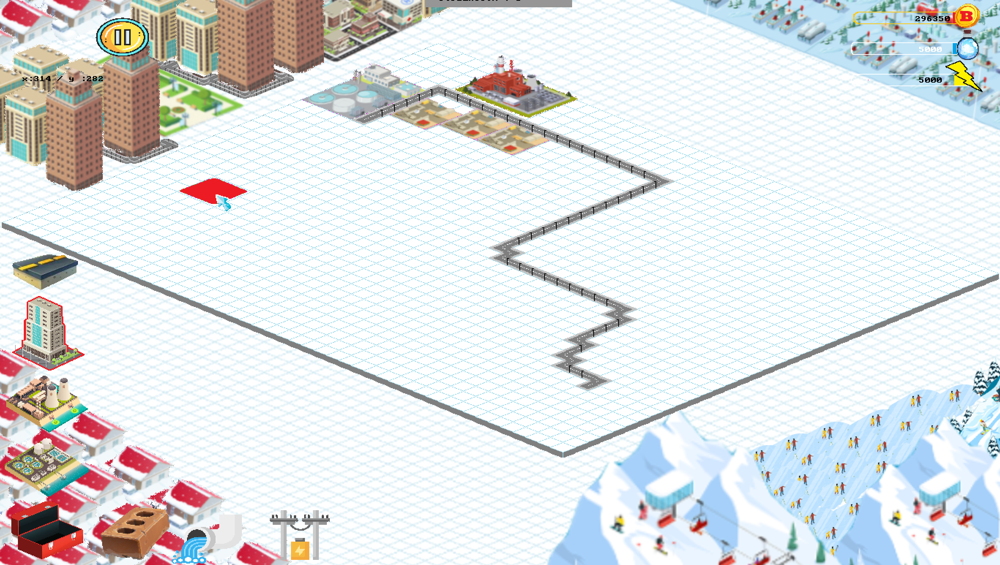
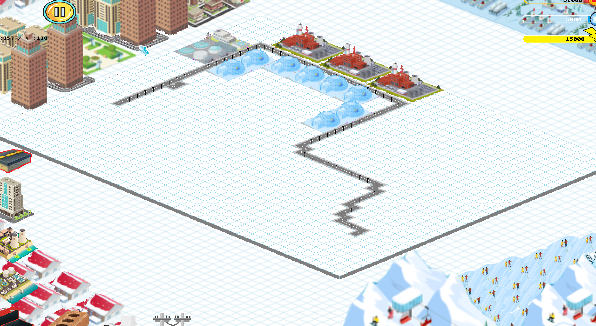
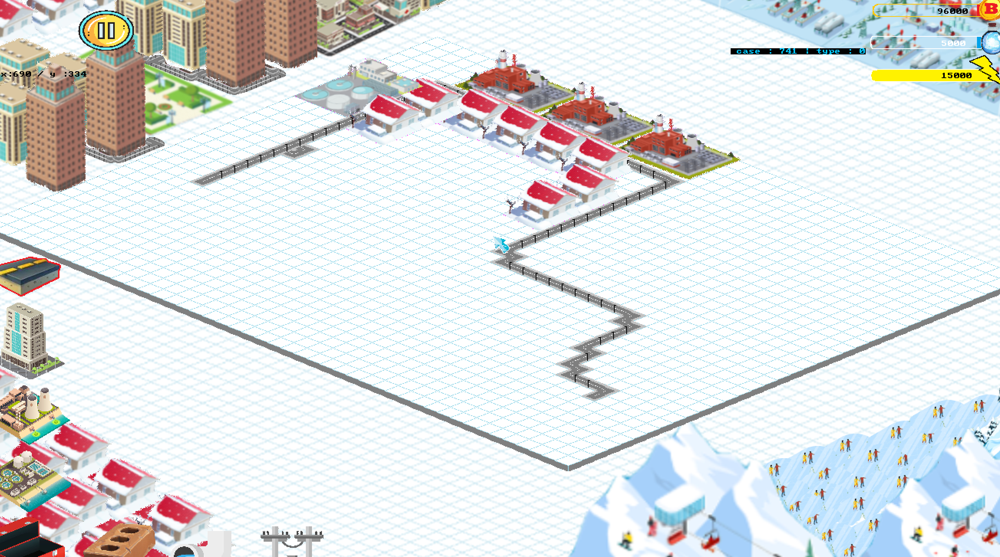
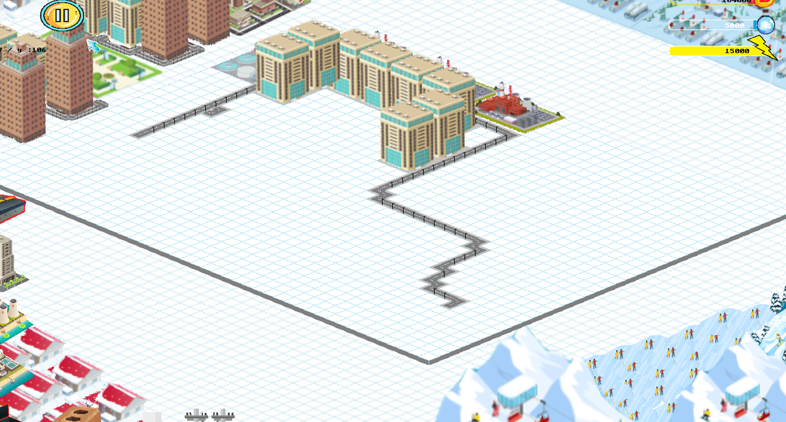
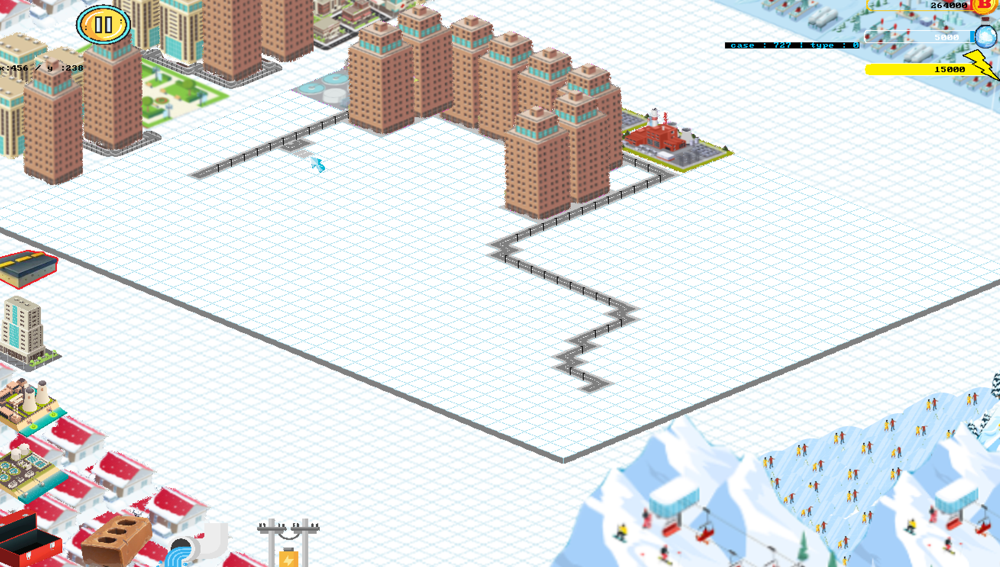
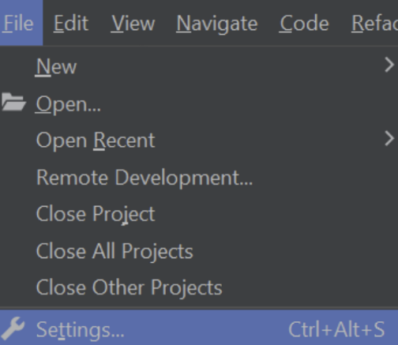
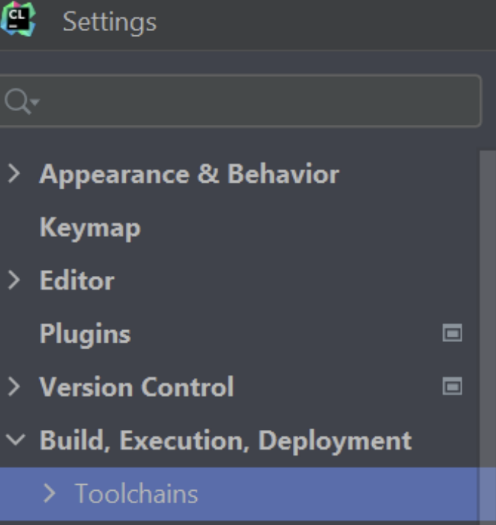
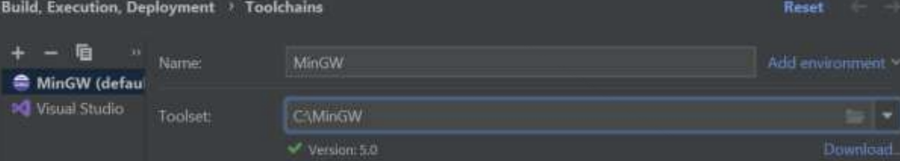

# Simcity
Projet Dofus

Ce projet est un projet scolaire réalisé durant ma première année d'étude à l'ECE Paris. Il s'agit d'un jeu de type Simcity réalisé en C avec la bibliothèque graphique Allegro4.4 et avec l'utilisation de la théorie des graphes.

## Présentation
Le changement d'IDE de CodeBlocks à CLion à causé quelques problèmes de fonctionnement. 
Le projet est donc actuellement en cours de réparation.
Ainsi, le projet compile cependant il n'est pas possible de lancer une partie. 

Voici quelques images présentant le projet lorsqu'il était fonctionnel:

### Chargement

### Jeu

## Installation
### Code Blocks
Si vous utilisez code blocks, vous pouvez suivre les étapes du lien suivant:
https://fercoq.bitbucket.io/allegro/#Installation

### CLion
Si vous utilisez CLion, vous pouvez suivre les étapes suivantes:

1. Allez sur le site : https://fercoq.bitbucket.io/allegro/#Installation
2. Suivez les étapes d'installations de allegro 4.4, cependant lors de l'extraction du fichier zip, extrayez le dans le dossier bin/mingw de votre CLion, de la même manière que avec code blocks.
3. Ouvrez CLion, allez dans File -> Settings -> Build,Execution,Deployment -> Toolchains
   
   
4. Dans toolset, choisissez MinGW que vous avez installé avec allegro dans le dossier bin/mingw de CLion.
   
   (Dans cet exemple le chemin est C:\MinGW)
5. Cliquez sur Apply puis OK
